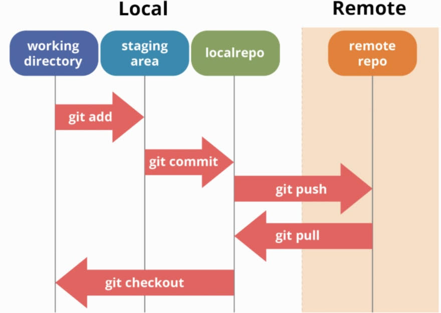

# Introduction to Git and GitHub

We will need Git for this course as it will be used extensively. It can be downloaded and installed from [this site](https://git-scm.com/downloads)

## What is Version Control?

- Utilized to ensure all code is maintained in a centralized location.
- Helps with code being contributed by multiple people.
- Allows for roll-back if any issues arrive.
- Keeps track of all changes done and equally important who changed the code at which stage.

## What is Git?

- Git is a VCS utility to allow for better version control
- Can be utilized ideally through the command line but also through the use of applications such as GitHub Desktop.
- Generally speaking is the go to VCS utility for a majority of tech companies.
- Utilizes commits and branches.

## What is GitHub

- Centralized site and hosting for git projects.
- Allows for remote work and connection to projects with a VCS.
- Helps facilitate open source projects through the use of merge and pull requests.
- Can be utilized via the command line or via built in integration through an IDE. Not all functionality is easily available through built in integration however.

## GitHub Best Practices

- Ensure that all commits are clear in what you're committing to the repository. Generally speaking they should be present tense statements, but different companies have different requirements.
  - Bad Example: `Adds work completed on 4/15/22` That is incredibly unclear for any future review of the repository. Yes, you might know what that means today but what if you need to look at the repo next year? OR what if that was a commit to a repo you're assisting on?
  - Good Example: `Adds new styling for about page`. This is clear what it adds and what it impacts
- Commits should ONLY commit one "thing" this might be a larger function implementation but a commit shouldn't be say: `Adds sorting function to posts page and styling to about page`. Those should be two separate commits and ideally separate branches.
- Utilize `branches` for different portions of a project.
- NEVER `commit` to master. This should be done with a merge as opposed to a commit directly to master.
- Don't use GitHub Desktop. VSCode and the terminal have so many more options and much more customizability you can use.

## The Command Line

- Learn it now and it will help you massively moving forwards.
- Resources for Mac Command Line (these can be utilized on a windows machine with something like gitbash): [Best Go to Commands](https://github.com/0nn0/terminal-mac-cheatsheet)
- Git should ideally be done via the command line as well as GitHub Desktop can be clunky at best.
- Resources for Github via command line:

# git cheat-sheet

Taken from [Dave Fredman's GitHub Page](https://gist.github.com/davfre/8313299)

### current state

`git status` list which (unstaged) files have changed  
`git diff` list (unstaged) changes to files  
`git log` list recent commits

### adding files to repo

`git add fn` stage file  
`git commit -m 'message'` commit file  
`git commit -am 'message'` add/commit all changes from all tracked files (no untracked files) in one go

### undoing previous actions

http://git-scm.com/book/en/Git-Tools-Rewriting-History  
`git reset filename` unstage file  
`git commit --amend -m 'message'` alter the last commit (add any staged files, new comment)  
`git reset --soft HEAD^` undo previous commit, put changes in staging  
`git reset --hard HEAD^` Undo last commit and all changes  
`git reset --hard HEAD^^` Undo two (^^) last commits and all changes  
`git checkout -- cats.html index.html` Undo all changes that were made to files cats.html and index.html  
`git rebase --onto <commit-id>\^ <commit-id> HEAD` remove specific commit from repository. the \ in \^ is just an escape char to make zsh play nice and is not necessary if using bash.

### remote repositories

`git remote add origin git@example.com:example/petshop.git` add a remote repository  
`git push -u origin master` push current local repo to remote. -u sets it to default for the future  
`git remote -v show` show the available remote repositories that have been added  
`git pull` checkout and merge remote changes in one go  
`git fetch origin` update the local cache of the remote repository  
`git remote -v update` bring remote refs up to date (and -v show which branches were updated)  
`git status -uno` will tell you whether the branch you are tracking is ahead, behind or has diverged. If it says nothing, the local and remote are the same.  
`git show-branch *master` will show you the commits in all of the branches whose names end in master (eg master and origin/master).  
`git show remote origin` show local<->remote branch tracking and sync status

### Examine changes on remote, without pulling them

`git fetch origin`  
`git log HEAD..origin/master --oneline` shows commit messages  
`git diff HEAD..origin/master` shows all changes on remote compared to local HEAD

### Branches

`git branch` list currently existing branches  
`git branch [branchname]` create new branch  
`git checkout branchname` move to that branch  
`git checkout -b branchname` create and checkout new branch in one go  
`git branch -d branchname` remove branch

#### merging branch back to master

`git checkout master; git merge branchname;` conditions for fast-forward merge - nothing new on master between branch start/end points

### branches on remote

` git fetch origin``git branch -r ` list remote branches (after a fetch)  
`git push origin :branchname` delete remote branch 'branchname'  
`git remote prune origin` clean up deleted remote branches (let's say someone else deleted a branch on the remote)  
`git show remote origin` show local<->remote branch tracking and sync status (duplicate info under "remote repositories")

#### push local branch to differently named remote branch. Eg Heroku only deploys master

`git push heroku yourbranch:master` simple form  
`git push heroku-staging staging:master` (localBranchName:remoteBranchName)

### tagging

`git tag` list all tags  
`git checkout v0.0.1` checkout code  
`git tag -a v0.0.3` -m 'Version 0.0.3' add new tag  
`git push --tags` push new tags to remote

### dealing with large files - keep them outside the repo on an ssh machine.

http://stackoverflow.com/questions/540535/managing-large-binary-files-with-git  
http://git-annex.branchable.com/walkthrough/ #see ssh section

`git annex add mybigfile`  
`git commit -m 'add mybigfile'`  
`git push myremote`
`git annex copy --to myremote mybigfile` this command copies the actual content to myremote  
`git annex drop mybigfile` remove content from local repo  
`git annex get mybigfile` retrieve the content  
`git annex copy --from myremote mybigfile`specify the remote from which to get the file

…or create a new repository on the command line

- echo "# test-repo" >> README.md
- git init
- git add README.md
- git commit -m "first commit"
- git remote add origin git@github.com:miketruax/
- test-repo.git
- git push -u origin master

…or push an existing repository from the command line

- git remote add origin git@github.com:miketruax/
- test-repo.git
- git push -u origin master
